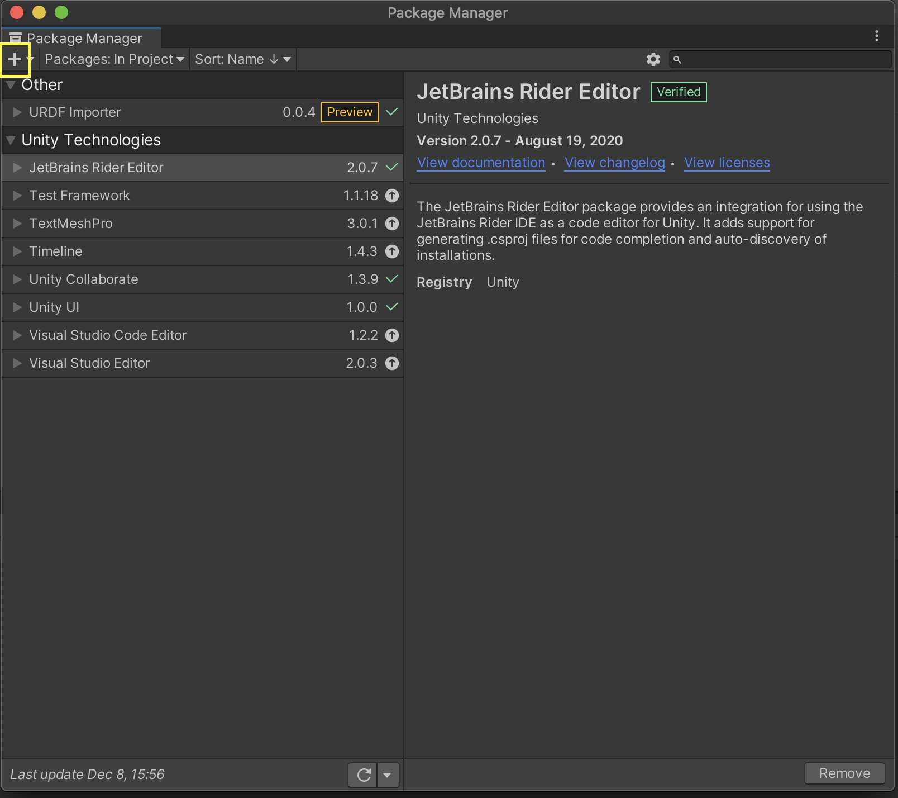

# URDF Importer 

URDF Importer allows you to import a robot defined in [URDF](http://wiki.ros.org/urdf/XML) format in a Unity scene. URDF defines the geometry, visual meshes, kinematic and dynamic attributes of a Robot. Importer parses a URDF file and imports it into Unity using PhyX 4.0 articulation bodies.

# Using the Package

## Adding the URDF package

1. Open the Package Manager from Unity Menu. Click `Window -> Package Manager`. A new package manager window will appear.

2. Click on the `+` sign on the top left corner of the package manager window and click on `Add Package from Git URL`. 

3. Paste the link to the URDF github, https://github.com/Unity-Technologies/URDF-Importer.git repository in the text box and press `Enter`. 

4. Click `Import URDF`.

## Importing the robot using URDF file

1. Copy the URDF and the associated files in the assets folder in the Project window. Make sure the [location](https://github.com/Unity-Technologies/Unity-Robotics-Hub/blob/main/tutorials/urdf_importer/urdf_appendix.md#file-hierarchy) of the mesh files is correct.

2. Right Click on the URDF file and click `Import Robot from Selected URDF file`.

3. A window will appear with the Import settings for the Robot. First setting mentions the orientation of the mesh files. The second setting is used to select the algorithm to be used in Collision mesh Decomposition. For more information click [here](https://github.com/Unity-Technologies/Unity-Robotics-Hub/blob/main/tutorials/urdf_importer/urdf_appendix.md#convex-mesh-collider)

4. Click `Import URDF`

# Tutorials

Instructions for using URDF importer can be found [here](https://github.com/Unity-Technologies/Unity-Robotics-Hub/blob/master/tutorials/urdf_importer/urdf_tutorial.md).
